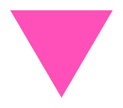

  

# Security, Safety, and Harm Reporting Policy

This repository exists for trans*, queer, Romani, migrant, racialised, sex-worker, disabled, and otherwise targeted poets and communities.

Because the world is not neutral, security here does not only mean code.  
It also means protection from doxxing, harassment, outing, targeted abuse, unwanted exposure, hostile scraping, impersonation, and political misuse.

## Reporting a security or safety issue

Please do not open a public issue if the report involves private information, harassment, identity exposure, abuse, or vulnerabilities.

Email us directly:

production@queerdos.eu

You can report:

- exposed API keys, tokens, credentials, or private files
- unsafe GitHub Actions workflow permissions
- malicious pull requests or files
- attempts to inject harmful code into poems or metadata
- doxxing, outing, harassment, threats, or targeted abuse
- impersonation of poets, contributors, or community members
- unwanted inclusion of someone’s work
- broken attribution, stolen work, or false authorship claims
- hostile scraping or reuse of archive material
- anything that could endanger a contributor, poet, organiser, or community

## What to include

If possible, include:

- what happened
- where you saw it
- links, screenshots, or file names
- why it may cause harm
- whether urgent removal is needed

You do not need to write a perfect report.  
A short message is enough.

## Our response

We will prioritise reports involving personal safety, identity exposure, harassment, or unwanted publication.

When needed, we may:

- remove or hide content
- close or delete issues and pull requests
- block or report abusive users
- rotate exposed secrets
- restrict repository permissions
- disable workflows
- revise attribution
- remove a poet’s work from the archive

## Poet removal requests

If SAPPHO D has found your work and you do not want it included, email:

production@queerdos.eu

We will remove it immediately.  
No questions.  
No debate.  
No performance of bureaucracy.

## Community safety

This archive refuses hate speech, harassment, fascist propaganda, racist, antiziganist, transmisogynist, homophobic, antisemitic, Islamophobic, ableist, or sex-worker-hostile content.

Submissions or interactions that endanger targeted communities may be removed without notice.

## Scope

This repository contains:

- Markdown poetry submissions
- contribution guidelines
- GitHub Actions workflows
- small Python scripts for validation and archive maintenance
- possible automated scouting drafts by SAPPHO D

The current `main` branch is the only supported version.

